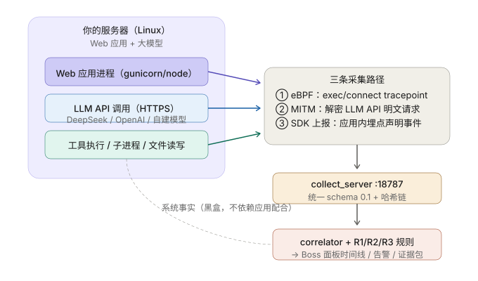

# webapp — 自建 Web 应用（含大模型）的 Agent 执行链跟踪

让任意"部署在 Linux 服务器上、内置大模型调用"的 Web 应用，接入 Beats Agent Tracker
的执行链跟踪与取证体系。



## 设计：三条采集路径

| 路径 | 组件 | 侵入性 | 能看到什么 |
|---|---|---|---|
| ① eBPF 黑盒 | `ebpf_web_tracer.py` | 零侵入 | 常驻进程树的每次 exec / TCP connect（内核态零漏采），R3 异常外联 |
| ② MITM | `agents/` 代理体系 | 零代码改动 | LLM API 请求/响应明文，R1"敏感信息进请求体"外泄检测 |
| ③ SDK 声明式上报 | `agent_trace_sdk.py` | 应用内埋点（极轻） | 用户对话轮次、模型调用、工具调用——应用"声明"的动作 |

**核心价值在 ① 与 ③ 的对照**：应用声明"我调了工具 X"，eBPF/MITM 的系统事实
显示它实际 exec 了什么、连了哪——声明与事实不符立刻暴露。correlator 的
pid + 路径 + 时间窗 join 把两条链合到同一条 trace。

## 关键设计点

1. **trace_id 按用户会话划分**（`web_<session_id>`），不按进程——多租户 Web 应用
   每个用户会话一条独立哈希链，取证时可分开导出。
2. **SDK 自带哈希链**（与 `runtime/trace.py` 完全一致的 canonical_core + sha256 算法），
   上报事件带完整 prev_hash/hash，`collect_server` / dashboard collector 均可直接链校验。
3. **daemon 进程树种子**：`ebpf_web_tracer.py` 的过滤种子从 sshd 会话改为
   systemd unit / cgroup / 进程名匹配——Web 应用是常驻服务，不在 sshd 树里。

## 快速上手

### 1. 启动 demo Web 应用（含 LLM 调用 + 工具执行）

```bash
# collector（dashboard 面板）在跑的前提下：
python3 webapp/demo_app.py --port 8899

# 浏览器打开 http://127.0.0.1:8899
# 发送 "现在几点了" 触发工具调用；发送带 ".env" 的消息触发 R1 敏感读取告警演示
```

无 `DEEPSEEK_API_KEY` 时自动用 mock LLM；有 key 则真实调用。

### 2. eBPF 黑盒采集（Linux 服务器，root）

```bash
# 按进程名锚定（推荐，最直观）
python3 webapp/ebpf_web_tracer.py --seed-cmd demo_app \
    --report-url http://127.0.0.1:18787/ingest

# 按 systemd unit 锚定
python3 webapp/ebpf_web_tracer.py --seed-unit my-webapp.service \
    --report-url http://127.0.0.1:18787/ingest
```

### 3. 给自己的 Web 应用埋点（3 行接入）

```python
from agent_trace_sdk import AgentTraceSDK

sdk = AgentTraceSDK(app_name="my-webapp",
                    collector_url="http://127.0.0.1:8787/ingest")
trace = sdk.session(session_id=user_session_id)   # 每个用户会话一条 trace
trace.user_message("帮我查一下库存")
trace.llm_request(model="deepseek-chat", prompt=messages)
trace.tool_invoke("query_db", {"sql": sql})
trace.llm_response(model="deepseek-chat", summary=reply)
trace.assistant_message(reply)
trace.flush()
```

## 事件流（demo 一次对话）

```
trace.begin (actor.agent = DemoWebApp)
└─ conversation.user      "现在几点了"
   ├─ llm.request         model=deepseek-chat, prompt=[...]
   ├─ tool.invoke         run_command / read_file（含参数，敏感路径自动触发 R1）
   ├─ tool.result
   ├─ llm.response
   └─ conversation.assistant
```

## 文件

| 文件 | 说明 |
|---|---|
| `design-diagram.svg` | 架构设计图 |
| `agent_trace_sdk.py` | 零依赖 Python SDK（声明式上报，自带哈希链与脱敏） |
| `demo_app.py` | 演示 Web 应用（stdlib 实现，含 LLM 调用与工具执行） |
| `ebpf_web_tracer.py` | daemon 进程树版 eBPF 采集器（BCC，exec/connect） |

## 已知限制

- eBPF 路径目前覆盖 exec + connect；文件读写事件依赖轮询采集（路线图：扩展
  `openat`/`write` tracepoint）。
- MITM 路径复用 `agents/` 现有体系，服务器侧需给 Web 应用配置代理或透明重定向。
